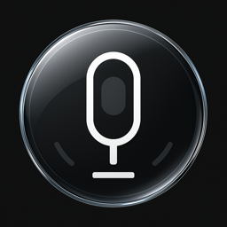

<p align="center">
  
</p>

# FreeWhisperKey

## What is it?

✅ Blazingly fast speech‑to‑text while holding your `Fn` key  
✅ 100% on‑device on your Mac — your audio never leaves your machine  
✅ Secure by design and fully open source — audit and fork the code  
✅ Super‑minimal UI — no bloat, no annoying sounds or popups  
✅ Forever free  

FreeWhisperKey lets you dictate anywhere on your Mac by simply holding your `Fn` key. While it’s held, your speech is transcribed to text; when you release it, dictation stops. You can choose which Whisper model to use, balancing speed and accuracy. No extra windows, no distractions.

## Installation

1. Download the latest `.dmg`:

   https://github.com/jostelzer/FreeWhisperKey/releases/download/v0.1.2/FreeWhisperKey-0.1.2.dmg

2. Open the downloaded file and drag `FreeWhisperKey.app` into your `Applications` folder.
3. Launch `FreeWhisperKey.app`.

### Permissions and why we need them

When you first run FreeWhisperKey, macOS will ask for a few permissions. Here’s what they mean and why they’re required:

- **Input Monitoring / Keyboard access**  
  - Needed to detect when you are holding the `Fn` key so we can start and stop recording.  
  - We do **not** log or store keystrokes; we only listen for the hotkey state.

- **Microphone access**  
  - Needed to capture your voice while you hold `Fn`.  
  - Audio is processed locally on your Mac to produce text, then discarded.  
  - No audio is uploaded or saved to disk.

- **Accessibility (if requested by macOS)**  
  - May be required so the app can observe key events globally.  
  - We do not automate or control other apps; this is purely to allow the global shortcut.

FreeWhisperKey never sends your audio or text to any server. Everything stays on your machine.

## Choosing a Whisper model

FreeWhisperKey lets you pick the Whisper model that best fits your needs:

- Smaller models → faster, use less CPU, slightly less accurate.  
- Larger models → slower, more accurate, higher resource usage.

Select your preferred model in the app’s settings/preferences to tune the trade‑off between speed and accuracy on your Mac.

## Contributing

Contributions, bug reports, and ideas are very welcome.

- Open an issue for bugs, feature requests, or questions.
- For pull requests, keep changes focused and small:
  - Explain the motivation and behavior change in the PR description.
  - If possible, include steps to test your change.

### Building the whisper.cpp bundle

FreeWhisperKey embeds the `whisper-cli` binary from [whisper.cpp](https://github.com/ggerganov/whisper.cpp).  
When rebuilding it for redistribution, make sure it targets macOS 13 so the bundle runs on Ventura and newer:

```bash
cd whisper.cpp
MACOSX_DEPLOYMENT_TARGET=13.0 cmake -S . -B build -DCMAKE_BUILD_TYPE=Release
MACOSX_DEPLOYMENT_TARGET=13.0 cmake --build build --target whisper-cli
cd ..
scripts/package_whisper_bundle.sh        # add --include-model to bundle ggml-base.bin
```

The packaging script now copies all dependent `.dylib`s into `dist/whisper-bundle/lib`, rewrites their
`rpath`s to use relative locations, and records their hashes in `manifest.json` so end users never see
missing-library errors.

## License

FreeWhisperKey is open source, released under the BSD 3‑Clause license. See `LICENSE` for details.
